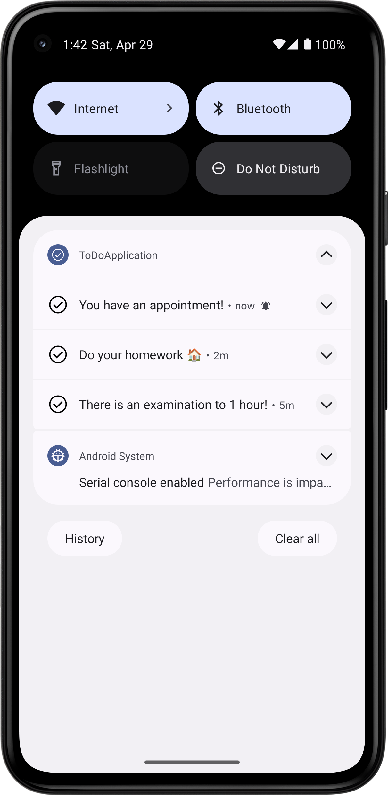
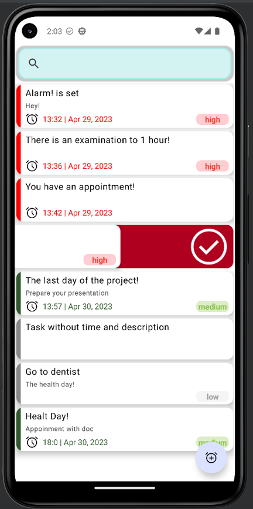
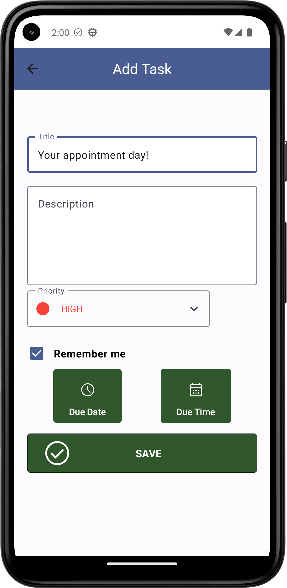
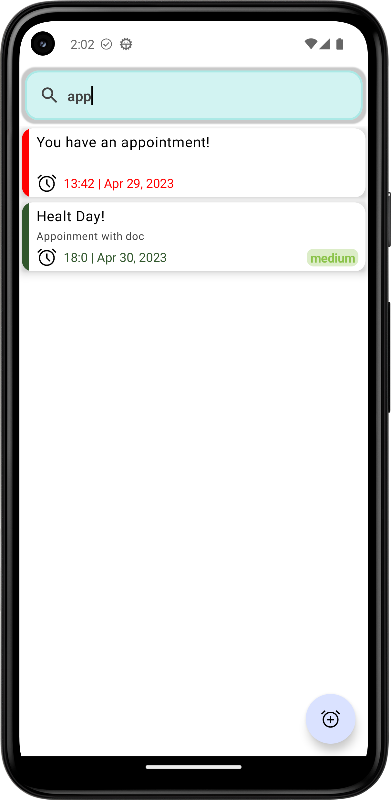
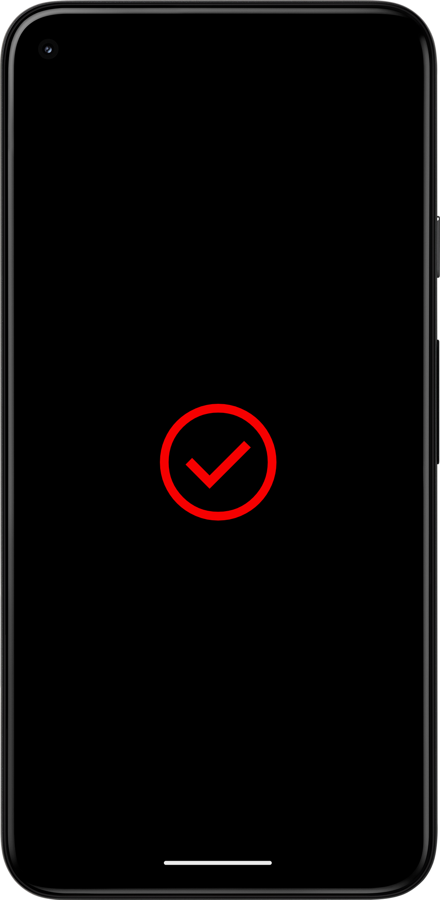

# MVVM To-Do :white_check_mark: Application using Jetpack Compose.

Don't forget to star the project if you like it!  :heart: ==  :star:

##  Dependencies :high_brightness:

| :key: Name      | :book: Description                                                                                                                                                                                                                          | 
|:----------------|:--------------------------------------------------------------------------------------------------------------------------------------------------------------------------------------------------------------------------------------------|
| `Jetpack`       | `Compose` : _Android's recommended modern toolkit to build UI._   `Swipe To Dismiss` _: Delete items in LazyColumn_  `Navigation` _: To switch between different screens_    `Live Data` _: Notify views about database changes | 
| `RxJava`        | _Composing asynchronous and event-based programs using observable sequences._                                                                                                                                                               | 
| `Coroutines`    | _Create asynchronous tasks._                                                                                                                                                                                                                | 
| `Room`          | _Provides fluent database access._                                                                                                                                                                                                          | 
| `MVVM`          | _`Model`:Holds the data of the application. It cannot directly talk to the View. `View`: represents the UI  `ViewModel`: Acts as a link between the Model and the View._                                                            | 
| `Dagger-Hilt`   | _A dependency injection library._                                                                                                                                                                                                           | 
| `Notifications` | _Alarm Manager, grant notification permissions_ , cancel alarm, set alarm                                                                                                                                                                   | 

#  _ScreenShots_  :camera:

| _Tasks Screen_               |        _Notification_        | 
|------------------------------|:----------------------------:|
|    |    |
| _Delete Task_                |          _Add Task_          |
|    |    |
| _Search_                     |       _Splash Screen_        |
|  |  |

#  _Architecture_  :bank:

### _Done_ :100:

- [x] Set alarm, cancel alarm, open activity from notification, set multiple and custom date-time notification.
- [x] Animated splash screen

